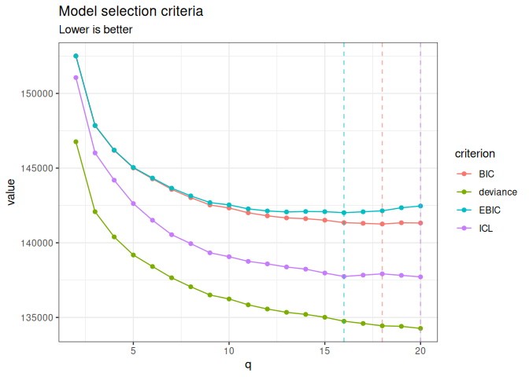

# normalblockr: Gaussian graphical models with latent clustering structure for multivariate continuous data

## Description

> The Normal-Block model[^1] is a Gaussian graphical model with a latent
> clustering structure, designed for the multivariate analysis of
> continuous data: it clusters variables and, building on the graphical
> lasso, infers a network of statistical dependencies *between clusters*
> rather than between individual variables. This package implements an
> efficient (variational) EM algorithm to fit it, accompanied by a set
> of functions for model selection, visualization and diagnostic. See
> [all the dedicated
> vignettes](https://jchiquet.github.io/normalblockr/articles/) for a
> comprehensive introduction.

**normalblockr** covers the following model variants, all built around
the same [`normal_block()`](reference/normal_block.md)/`NormalBlockData`
interface:

- **Known clusters**: the grouping of variables is given (e.g. from
  prior knowledge); only the association network between clusters is
  estimated, by EM.
- **Unknown clusters**: the grouping is inferred jointly with everything
  else by a variational EM, either for a single number of clusters or
  over a range explored as a collection, with model selection via
  BIC/EBIC/ICL.
- **Sparse (graphical-lasso) network**: an $`\ell_1`$ penalty[^2] on the
  inter-cluster precision matrix, for a single penalty value or a path
  explored as a collection.
- **Zero-inflated extension**: an excess-of-zeros layer for data
  (e.g. abundance/biomass tables) with more exact zeros than a plain
  Normal model can represent.

Any combination of these is reached through the same
[`normal_block()`](reference/normal_block.md) function: known or unknown
clustering, sparse or not, zero-inflated or not are independent choices,
not separate model classes to learn.

Since version 0.3.0 the package also fits a second, complementary
family, reached with `normal_block(..., model = "mean")`:

- **Mean-block models**: variables are clustered by how they *respond*
  to the covariates rather than by how they *covary*. All variables in a
  cluster share one regression profile, so the mean is
  $`\mu_i = C B^\top X_i`$ with $`B`$ of size $`d \times q`$ instead of
  $`d \times p`$. Known or unknown clustering, zero-inflated or not,
  with the residual covariance taken diagonal (the default), spherical,
  or full.

The two families answer different questions and generally return
different groupings;
[`normal_block_sequential()`](reference/normal_block_sequential.md) runs
one after the other when both are of interest. See the [mean-block
vignette](https://jchiquet.github.io/normalblockr/articles/mean-block-breast-cancer.html).

## Installation

Install the released version from CRAN:

``` r

install.packages("normalblockr")
```

or the development version from
[GitHub](https://github.com/jchiquet/normalblockr):

``` r

# install.packages("pak")
pak::pak("jchiquet/normalblockr")
```

## Illustration

We illustrate the known-/unknown-clusters and sparse variants on
`brca_rppa`[^3]: reverse-phase protein array measurements of 163
proteins across 346 breast cancer tumor samples from The Cancer Genome
Atlas, together with each sample’s PAM50 molecular subtype.

``` r

library(normalblockr)
data(brca_rppa)
Y    <- as.matrix(brca_rppa$expr)
X    <- model.matrix(~ 0 + PAM50_SUBTYPE, data = brca_rppa$covariates)
data <- NormalBlockData$new(Y, X)
```

### Known clusters

A simple, fully data-driven grouping (hierarchical clustering on the raw
expression profiles, with no reference to the Normal-Block model) handed
to [`normal_block()`](reference/normal_block.md) as fixed – only the
network between the 6 blocks is estimated.

``` r

hc    <- brca_rppa$expr |> scale() |> t() |> dist() |> hclust("ward.D2")
group <- cutree(hc, 6) |> normalblockr:::as_indicator()
m_known <- normal_block(data, blocks = group)
```

``` R
Fitting a diagonal normal-block-var model with fixed blocks 

DONE
```

``` r

m_known
```

``` R
A diagonal normal-block-var model with fixed blocks .
===========================================================================
 nb_param q n_edges sparsity    loglik deviance      BIC      ICL   EBIC niter
      999 6      15        0 -70387.84 140775.7 146616.3 144073.3 146670    14
===========================================================================
* Useful fields
    $model_par, $posterior_par / $var_par, $clustering 
    $loglik, $BIC, $ICL, $objective, $nb_param, $criteria
* Useful S3 methods
    print(), summary(), plot(), coef(), sigma(), fitted(), predict() 
```

### Unknown number of clusters

Leave the clustering for the model to infer, over a range of candidate
cluster counts explored as a collection, then select by ICL.

``` r

m_unknown <- normal_block(data, blocks = 2:20)
```

``` R
Fitting a diagonal normal-block-var model with unknown q 
     number of blocks = 2           
     number of blocks = 3           
     number of blocks = 4           
     number of blocks = 5           
     number of blocks = 6           
     number of blocks = 7           
     number of blocks = 8           
     number of blocks = 9           
     number of blocks = 10           
     number of blocks = 11           
     number of blocks = 12           
     number of blocks = 13           
     number of blocks = 14           
     number of blocks = 15           
     number of blocks = 16           
     number of blocks = 17           
     number of blocks = 18           
     number of blocks = 19           
     number of blocks = 20           
DONE
```

``` r

m_unknown$refine(verbose = FALSE)
m_unknown$plot(c("deviance", "BIC", "ICL", "EBIC"))
```



``` r

m_unknown$get_best_model("EBIC")
```

``` R
A diagonal normal-block-var model with 16 unknown blocks .
===========================================================================
 nb_param  q n_edges sparsity    loglik deviance      BIC      ICL     EBIC
     1129 16     120        0 -67374.79 134749.6 141350.2 137746.6 142015.6
 niter
    32
===========================================================================
* Useful fields
    $model_par, $posterior_par / $var_par, $clustering 
    $loglik, $BIC, $ICL, $objective, $nb_param, $criteria
* Useful S3 methods
    print(), summary(), plot(), coef(), sigma(), fitted(), predict() 
```

### Sparse network

Treating a clustering as fixed (known, or selected above), explore a
path of graphical-lasso penalties on the inter-cluster network and
select by BIC. Unlike the dense, unpenalized network, this is the one
actually worth visualizing.

``` r

m_sparse <- normal_block(data, blocks = group, sparsity = TRUE)
```

``` R
Fitting a Collection of diagonal normal-block-var models with fixed blocks, with different sparsity penalties. 
     penalty = 0.2565018           
     penalty = 0.2188391           
     penalty = 0.1867065           
     penalty = 0.1592919           
     penalty = 0.1359028           
     penalty = 0.1159479           
     penalty = 0.098923           
     penalty = 0.08439792           
     penalty = 0.07200559           
     penalty = 0.06143286           
     penalty = 0.05241254           
     penalty = 0.04471669           
     penalty = 0.03815085           
     penalty = 0.03254907           
     penalty = 0.02776982           
     penalty = 0.02369232           
     penalty = 0.02021353           
     penalty = 0.01724553           
     penalty = 0.01471333           
     penalty = 0.01255294           
     penalty = 0.01070977           
     penalty = 0.009137229           
     penalty = 0.00779559           
     penalty = 0.006650947           
     penalty = 0.005674374           
     penalty = 0.004841193           
     penalty = 0.004130351           
     penalty = 0.003523882           
     penalty = 0.003006463           
     penalty = 0.002565018           
DONE
```

``` r

sp_best  <- m_sparse$get_best_model("BIC")
sp_best$plot_network()
```


### Zero-inflated data

For data with an excess of exact zeros beyond what a plain Normal model
would represent (e.g. abundance/biomass tables), `zero_inflation = TRUE`
adds a per-variable excess-of-zero layer. Illustrated on `onema`[^4]:
total biomass of 46 fish species across 399 French stream electrofishing
stations, where seven in ten entries are exact zeros.

``` r

data(onema)
X_zi    <- model.matrix(~ 1 + temperature_med, data = onema$covariates)
Y_zi    <- log(1 + onema$biomass)
data_zi <- NormalBlockData$new(Y_zi, X_zi)
m_zi    <- normal_block(data_zi, blocks = 2:8, zero_inflation = TRUE)
```

``` R
Fitting a diagonal normal-block-var model with unknown q 
     number of blocks = 2           
     number of blocks = 3           
     number of blocks = 4           
     number of blocks = 5           
     number of blocks = 6           
     number of blocks = 7           
     number of blocks = 8           
DONE
```

``` r

m_zi$get_best_model("ICL")
```

``` R
A zero-inflated diagonal normal-block-var model with 6 unknown blocks .
===========================================================================
 nb_param q n_edges sparsity    loglik deviance      BIC      ICL     EBIC
      210 6      15        0 -13519.35 27038.71 28296.39 27090.47 28350.14
 niter
    20
===========================================================================
* Useful fields
    $model_par, $posterior_par / $var_par, $clustering 
    $loglik, $BIC, $ICL, $objective, $nb_param, $criteria
* Useful S3 methods
    print(), summary(), plot(), coef(), sigma(), fitted(), predict() 
```

## Learning more

- [`normal-block`](https://jchiquet.github.io/normalblockr/articles/normal-block.html)
  ([`vignette("normal-block")`](articles/normal-block.md)): a general
  introduction on simulated data – known/unknown clusters, sparsity,
  zero-inflation.
- [`zero-inflated-normal-block`](https://jchiquet.github.io/normalblockr/articles/zero-inflated-normal-block.html)
  ([`vignette("zero-inflated-normal-block")`](articles/zero-inflated-normal-block.md)):
  a full worked example on `onema`, with the math behind the
  zero-inflation extension.
- [`breast-cancer-proteomics`](https://jchiquet.github.io/normalblockr/articles/breast-cancer-proteomics.html)
  ([`vignette("breast-cancer-proteomics")`](articles/breast-cancer-proteomics.md)):
  a full worked example on `brca_rppa` – known vs. inferred clustering,
  model selection, the post-hoc `refine()` step, sparsifying the
  selected network.
- [`mean-block-breast-cancer`](https://jchiquet.github.io/normalblockr/articles/mean-block-breast-cancer.html)
  ([`vignette("mean-block-breast-cancer")`](articles/mean-block-breast-cancer.md)):
  the mean-block family on `brca_rppa` – clustering proteins by their
  subtype signature, choosing the shape of the residual covariance,
  sparsifying it.
- [`inst/normal_block_models.qmd`](https://jchiquet.github.io/normalblockr/normal_block_models.pdf)
  in the package sources: a reference card in two parts, the models
  (both families, with their criteria and E/M or VE/M updates) and the
  implementation notes.

## Note on the use of generative AI

The models implemented here – their definition and every algebraic
derivation – were worked out by Jeanne Tous and Nestor Ngalala
Manguitini and their advisor, Julien Chiquet, over a PhD thesis and a
Master’s research internship respectively, who also wrote the first
working versions of the code, its object-oriented architecture, and the
first simulation studies. Generative AI (Claude Sonnet and Claude Opus,
Anthropic) was used afterwards to improve the documentation, produce
synthesis material, and audit, test and improve the code – in particular
to port several algorithmic components to C++, including the graphical
lasso solver, whose original R-callback implementation caused
intermittent memory crashes. See the [technical
report](https://jchiquet.github.io/normalblockr/normal_block_models.pdf)
for details.

## References

[^1]: Tous, J., & Chiquet, J. (2026). An integrated method for
    clustering and association network inference. Computational
    Statistics & Data Analysis, 219, 108347.
    [doi:10.1016/j.csda.2026.108347](https://doi.org/10.1016/j.csda.2026.108347)

[^2]: Friedman, J., Hastie, T. and Tibshirani, R. Sparse inverse
    covariance estimation with the graphical lasso. Biostatistics, 9(3),
    2008.

[^3]: Cancer Genome Atlas Network. Comprehensive molecular portraits of
    human breast tumours. Nature, 490, 2012, 61-70.
    [doi:10.1038/nature11412](https://doi.org/10.1038/nature11412)

[^4]: Danet, A., Mouchet, M., Bonnaffé, W., Thébault, E., Fontaine, C.
    Species richness and food-web structure jointly drive community
    biomass and its temporal stability in fish communities, data set,
    2021, Zenodo.
    [doi:10.5281/zenodo.5095656](https://doi.org/10.5281/zenodo.5095656)
